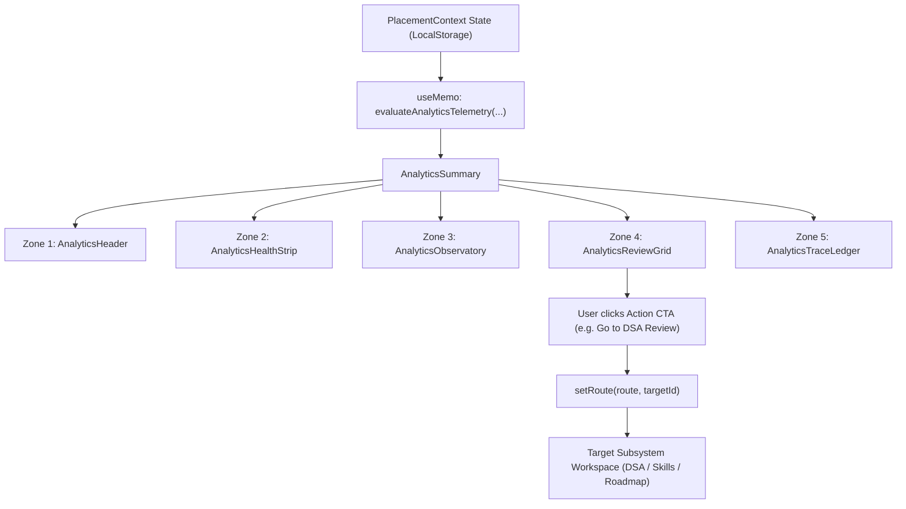

# PlacementOS Analytics Page — Final Visual Specification v1.0

**Status:** SPECIFICATION ONLY — FROZEN. No UI manufacturing is authorized by this document alone; it is the definitive engineering blueprint for the subsequent manufacturing task.
**Baseline commit:** `39a0d61` — `feat(interview): redesign readiness scorecard`
**Date:** 2026-10-07
**Scope:** `src/components/analytics/*` (`AnalyticsView.tsx`, `TelemetryTraceabilityModal.tsx`, and modularized child components), integration with `PlacementContext.tsx`, `analyticsEngine.ts`, `evidenceTrace.ts`, `skillsEngine.ts`, `reviewScheduler.ts`, `remediationRouter.ts`, `weaknessRouter.ts`, and the Analytics test suite.

> **Reading Contract.**
> This document resolves every visual, architectural, behavioral, responsive, accessibility, animation, and test-preservation decision for the Analytics page redesign. Manufacturing must not reopen these decisions. Sections marked **LOCKED** are final. The specification strictly preserves all existing engine functions (`analyticsEngine.ts`, `skillsEngine.ts`, `evidenceTrace.ts`, `reviewScheduler.ts`), storage schemas (`storageAdapter.ts`), routing contracts, evidence accumulation algorithms, and test assertions. The only file created in this task is this specification document.

---

## 1. Status — LOCKED

- **Subsystem:** Analytics & Operational Telemetry Review (`#/analytics`)
- **Document Version:** 1.0 (Frozen Architecture Specification)
- **Implementation State:** Specification Frozen. Ready for Phase 2 UI Manufacturing.
- **Authority:** Pure Deterministic Telemetry & Evidence Evaluation (`analyticsEngine.ts`).

---

## 2. Baseline Commit & Working Tree Verification — LOCKED

- **Current Baseline HEAD:** `39a0d61` (`feat(interview): redesign readiness scorecard`)
- **Remote Parity:** `HEAD == origin/main == 39a0d61`
- **Protected File Exception:** `src/components/dashboard/TodayGuide.tsx` (untracked working-tree file, strictly preserved and untouched).
- **Modification Rule:** No production code or tests in `src/` are modified during this audit and specification task.

---

## 3. Subsystem Purpose & Mission — LOCKED

PlacementOS is a local-first, zero-backend personal placement preparation operating system spanning September 2026 to May 2027.

The **Analytics Subsystem** (`#/analytics`) is the candidate's **Deterministic Operational Telemetry Console & Evidence Review Observatory**. In campus placement preparation, studying blindly without measuring learning velocity, retention quality, and operational bottlenecks leads to failure. Candidates often fall into common traps:
1. Solving problems with continuous hints while mistaking assisted passes for genuine mastery.
2. Allowing spaced repetition items in Leitner boxes to decay past their review dates.
3. Postponing difficult theory or implementation tasks repeatedly without decomposing them.
4. Letting previously mastered topics go stale without fresh evidence.
5. Tracking estimated time instead of honest, recorded study minutes.

The Analytics page solves these problems by providing an **honest, unembellished, evidence-backed instrumentation panel**. It enforces strict engineering truthfulness:
- **No Fabricated History:** Historical trends are derived solely from real timestamps in sealed check-ins, DSA attempts, and evidence logs. If no activity exists, the system anchors to today and honestly reports zero activity rather than projecting fake baseline curves.
- **No Fake Overall Scores:** The subsystem does not blend disparate metrics into an arbitrary "Overall Placement Percentage". Readiness, consistency, retention, and velocity are reported as independent, orthogonal telemetry vectors.
- **Deterministic Review Routing:** Every operational gap (overdue reviews, remediation debt, stale topics, repeated postponements, low independence) produces an actionable, causal recommendation linked to real entity IDs.

---

## 4. 5-Second Comprehension Test — LOCKED

A candidate opening the Analytics page must instantly answer these 5 questions within **5 seconds**:

| Question | Forensic Answer on Redesigned Analytics Console |
|---|---|
| **1. What is my operational velocity in this window?** | **Telemetry Health Strip** displaying exact logged hours, sealed days consistency %, roadmap tasks completed, and DSA problems solved. |
| **2. What is the quality and independence of my practice?** | **Quality & Retention Radar** showing the exact Independent vs. Assisted solve ratio and Leitner spaced repetition retention rate. |
| **3. Where is my memory decaying or progress blocked?** | **Operational Bottleneck Counter** highlighting overdue Leitner reviews, active remediation debt, stale topics (>14d inactive), and repeatedly postponed tasks. |
| **4. What single review action should I execute right now?** | **Hero Review Spotlight** highlighting the top-priority review prompt (e.g. *"Resolve 3 Overdue DSA Reviews"* or *"Clear Remediation Debt"*) with a 1-click CTA. |
| **5. What raw proof-of-work backs up these metrics?** | **Telemetry Trace Ledger & Raw Audit Modal** exposing exact timestamps, problem numbers, Leitner box levels, and recorded study minutes. |

---

## 5. Route & Deep-Link Model — LOCKED

### 5.1 Routing Contracts
- **Base Route:** `#/analytics` (renders the Operational Telemetry Console with default `30d` time window).
- **Time Window Parameter:** Synchronized in local view state with supported canonical windows:
  - `7d` — Rolling 7-day operational sprint view
  - `30d` — Rolling 30-day preparation cycle view (default)
  - `phase` — Active phase horizon (anchored to `activePhase.startDate`)
  - `all` — Full historical timeline (anchored to earliest recorded activity timestamp)
- **Deep-Link Target Handling:** When navigating to `#/analytics` from external review cues, the view preserves time window context and scrolls to active review recommendations.

### 5.2 Outgoing Handoff Contracts
Every review recommendation button deterministically calls `setRoute(route, targetId)` with verified target routes:
- Overdue DSA review $\to$ `setRoute('dsa', problemId)`
- DSA remediation drill $\to$ `setRoute('dsa', problemId)`
- Stale topic evidence investigation $\to$ `setRoute('skills', topicId)`
- Repeatedly postponed roadmap task $\to$ `setRoute('roadmap', taskId)`
- Low independence practice drill $\to$ `setRoute('dsa')`

---

## 6. Current Page Architecture & Forensic Map — LOCKED

### 6.1 Current Component Structure
```
AppShell (src/components/layout/AppShell.tsx)
└── AnalyticsView (src/components/analytics/AnalyticsView.tsx) [236 lines]
    ├── Header & Time Window Switcher (7d | 30d | phase | all)
    ├── Date Range Banner (startDateISO to endDateISO, Raw Telemetry Logs button)
    ├── Activity Summary Grid (Hours Logged, Tasks Completed, DSA Solved)
    ├── Key Review Recommendations Grid (ReviewPrompt cards with EvidenceTracePanel)
    └── TelemetryTraceabilityModal (src/components/analytics/TelemetryTraceabilityModal.tsx) [145 lines]
```

### 6.2 Forensic Audit Findings
- **Modularization Deficit:** The current `AnalyticsView.tsx` combines header, time-window controls, KPI blocks, review cards, and handoffs into a single component rather than a structured 5-zone hierarchy.
- **Missing Observatories:** Rich telemetry data calculated by `analyticsEngine.ts` (e.g., `boxDistribution`, `reviewRetentionRate`, `assistedSolveRatio`, `activePhaseCompletionRate`, `patternsAttemptedCount`, `overallDomainReadiness`) are calculated in pure logic but under-visualized in the current UI.
- **Legacy Styling:** Relies on raw hex codes (`#14171D`, `#262D38`, `#E5A93C`, `#8E98A8`, `#F1F5F9`) rather than modern obsidian token elevation tiers and semantic borders.
- **Modal Isolation:** The raw telemetry logs modal exists but lacks inline filtered views for rapid inspection without opening a modal overlay.

---

## 7. Canonical Data Sources & Pure Engine Authority — LOCKED

The Analytics subsystem observes canonical state and never mutates underlying preparation data directly.

| Telemetry Domain | Canonical Engine Function | Source Data Inputs | Immutable Output Properties |
|---|---|---|---|
| **Master Telemetry Evaluation** | `evaluateAnalyticsTelemetry(...)` in `src/engine/analyticsEngine.ts` | `tasks`, `taskProgress`, `dsaProblems`, `dsaProgress`, `dsaAttempts`, `topics`, `domains`, `skillStates`, `dailyCheckIns`, `companyOverlays`, `activePhase`, `evidenceLogs` | `AnalyticsSummary` (`activity`, `quality`, `progress`, `gaps`, `reviewPrompts`, `topicReadiness`) |
| **Window Start Date Calculation** | `calculateWindowStartDate(...)` in `src/engine/analyticsEngine.ts` | `timeWindow`, `todayISO`, `activePhase`, `earliestActivityISO` | `startDateISO` (string `YYYY-MM-DD`) |
| **Topic & Domain Readiness** | `calculateTopicReadiness(...)` & `calculateDomainReadinessList(...)` in `src/engine/skillsEngine.ts` | `topics`, `domains`, `taskProgress`, `dsaProgress`, `skillStates`, `companyOverlays` | `topicReadiness: TopicReadiness[]`, `overallDomainReadiness` (0–100%) |
| **Review Candidate Scheduling** | `generateReviewCandidates(...)` in `src/engine/reviewScheduler.ts` | Consumes `summary.reviewPrompts` as validation signals | `ReviewCandidate[]` |
| **Evidence Trace Generation** | `buildAnalyticsPromptTrace(...)` in `src/engine/evidenceTrace.ts` | `prompt`, `EvidenceCatalog` | `EvidenceTrace` (causal chain $\to$ contributing evidence sources) |
| **Weakness & Remediation Routing** | `routeRemediationCandidates(...)` in `src/engine/remediationRouter.ts` | `weaknessSignals`, `dsaProgress`, `practiceAttempts` | `RemediationRoute[]` |

---

## 8. Canonical Metric Audit — LOCKED

Every metric displayed on the Analytics page is audited and traced to its mathematical derivation:

```
+----------------------------------------------------------------------------------------------------+
|                                      ANALYTICS METRIC AUDIT TABLE                                  |
+------------------------------+---------------------------+-----------+----------+------------------+
| Metric Name                  | Derivation / Formula      | Range     | Window   | Canonical Status |
+------------------------------+---------------------------+-----------+----------+------------------+
| activity.studyHours          | Max(CheckInMin, TaskMin)  | 0.0 - ∞ h | Window   | Informational    |
| activity.completedTasksCount | Count(Task.completed)     | 0 - N     | Window   | Activity Exact   |
| activity.sealedDaysCount     | Count(CheckIn.isSealed)   | 0 - Days  | Window   | Activity Exact   |
| activity.consistencyRate     | (SealedDays / TotalDays)% | 0 - 100%  | Window   | Informational    |
| activity.dsaPassedCount      | Count(Attempt.pass)       | 0 - N     | Window   | Activity Exact   |
| quality.independentSolveRatio| (IndepPass / PassedCount)%| 0 - 100%  | Window   | Quality Exact    |
| quality.assistedSolveRatio   | (AssistPass / PassedCount)| 0 - 100%  | Window   | Quality Exact    |
| quality.reviewRetentionRate  | (ReviewPass / RevAttempts)| 0 - 100%  | Window   | Quality Exact    |
| quality.boxDistribution      | Count per Box (1, 2, 3, 4)| 0 - 150   | Current  | Structural Exact |
| progress.roadmapCompletion   | (Completed / TotalTasks)% | 0 - 100%  | All Time | Progress Exact   |
| progress.phaseCompletion     | (PhaseDone / PhaseTasks)% | 0 - 100%  | Phase    | Progress Exact   |
| progress.domainReadiness     | Weighted Mean(DomainScore)| 0 - 100%  | Current  | Skills Engine    |
| progress.patternProgression  | Attempted / 17 Patterns   | 0 - 17    | Current  | DSA Catalog      |
| gaps.overdueDsaCount         | Count(NextReview <= Today)| 0 - 150   | Current  | Gap Telemetry    |
| gaps.staleEvidenceCount      | Count(Freshness == stale) | 0 - N     | Current  | Gap Telemetry    |
| gaps.postponedTasksCount     | Count(PostponeCount >= 2) | 0 - N     | Current  | Gap Telemetry    |
| gaps.remediationRequired     | Count(Remediation == true)| 0 - 150   | Current  | Gap Telemetry    |
+------------------------------+---------------------------+-----------+----------+------------------+
```

### Critical Verification Notes:
1. **`studyHours` and `consistencyRate`** are strictly informational telemetry. `analyticsEngine.ts` explicitly marks them as unused by the deterministic adaptive scoring algorithm to prevent circular feedback loops.
2. **Planned task estimates are never counted as study time.** Only actual minutes recorded during evening check-in (`totalActualMinutes`) or task time tracking (`timeSpentMinutes`) are summed.
3. **Cross-Page Readiness Identity:** `summary.topicReadiness` uses the identical `calculateTopicReadiness` invocation as `SkillsView.tsx` with identical `companyOverlays` applied, guaranteeing 100% numerical consistency across pages.

---

## 9. Historical-Data & Trend Audit — LOCKED

### 9.1 Genuine Persisted Historical Data
PlacementOS records timestamped historical artifacts in `localStorage`:
- `DailyCheckIn`: Contains `date` (`YYYY-MM-DD`), `totalActualMinutes`, `isSealed`, `mode`, `energyLevel`.
- `DSAAttempt`: Contains `date`, `createdAt` (`ISO`), `result` (`pass` | `partial` | `fail`), `assistanceLevel` (`none` | `hint` | `solution`), `timeTakenMinutes`, `problemId`.
- `TaskProgress`: Contains `lastCompletedAt` (`ISO`), `timeSpentMinutes`, `postponeCount`, `state`.
- `EvidenceLog`: Contains `timestamp` (`ISO`), `score` ($0..100$), `confidence` ($1..5$), `sourceType`, `topicId`, `domainId`.
- `PracticeAttempt`: Contains `date`, `completedAt` (`ISO`), `scorePct`, `accuracyPct`, `passed`, `totalTimeSeconds`.
- `AssessmentSnapshot`: Contains `takenAt` (`ISO`), `domainResults`, `kind`.

### 9.2 Trend Feasibility Contract
- **Allowed Visualizations:**
  - Daily Activity & Study Time Bars (derived from sealed `dailyCheckIns` and `dsaAttempts` within the window).
  - DSA Attempt Outcome Breakdown (Pass Independent vs Pass Assisted vs Fail across the selected window).
  - Leitner Box 1–4 Distribution (current snapshot counts).
  - 17-Pattern Coverage Progress (attempted vs unattempted).
  - Domain Readiness Distribution (11-domain horizontal bars).
- **Strictly Forbidden Visualizations:**
  - Continuous simulated 30-day readiness curves (no daily domain snapshot series exists).
  - Projected "AI predictive placement probability" lines.
  - Fabricated activity prior to the earliest recorded timestamp (`findEarliestActivityDate`).

---

## 10. Current UX Audit — LOCKED

| UX Dimension | Current State | Forensic Rating | Redesign Mandate |
|---|---|---|---|
| **5-Second Comprehension** | Basic 3-card summary and prompt list. | **MODERATE** | Introduce high-density 4-block Telemetry Health Strip and Hero Review Spotlight. |
| **Visual Hierarchy** | Flat cards with legacy gold accents. | **DATED** | Elevate to multi-tier obsidian surfaces with Crimson Pulse telemetry accents. |
| **Information Density** | Wasted horizontal whitespace; Leitner and pattern telemetry hidden in memory. | **LOW** | Integrate dual-panel Telemetry Observatory for Leitner and Pattern progress. |
| **Action Dominance** | Review cards compete with equal visual weight. | **DIFFUSE** | Establish high-severity review prominence with distinct 1-click execution CTAs. |
| **Telemetry Traceability** | Raw logs buried inside a separate modal. | **DISCONNECTED** | Provide inline expandable trace ledgers alongside the modal inspector. |
| **Responsive Adaptability** | Stacks vertically without optimized mobile dense mode. | **BASIC** | Full 5-breakpoint responsive matrix ($1440\text{px}+$, $1280\text{px}$, $1024\text{px}$, $768\text{px}$, $375\text{px}$). |

---

## 11. Visual Metaphor — LOCKED

### **"The Placement Telemetry Console & Operational Health Observatory"**

Analytics is the flight recorder and diagnostic radar of PlacementOS. It is not an ornamental dashboard; it is a **precision telemetry console** engineered for operational clarity:
- **Obsidian Foundations:** Deep space surfaces (`#0C0E11`, `#14171D`, `#1B2028`) provide an ultra-dark backdrop minimizing eye fatigue during long analytical sessions.
- **Instrument Readouts:** Monospace typography (`JetBrains Mono`) for all numeric metrics, timestamps, percentages, and problem numbers.
- **Sub-Surface Laser Borders:** 1px hairline borders (`#262D38` / `#333B48`) defining crisp geometric data partitions.
- **Diagnostic Signal Pulses:** Subtle, non-distracting telemetry pulse indicators signifying live data evaluation.

---

## 12. Design Tokens & Elevation Hierarchy — LOCKED

```css
/* ---- Core Analytics Surface Elevation Tier ---- */
--analytics-bg-base:        #0C0E11; /* Ground floor */
--analytics-surface-card:   #14171D; /* Tier 1 Elevation */
--analytics-surface-elevated:#1B2028; /* Tier 2 Interactive / Modal / Trace */
--analytics-surface-inset:   #0F1216; /* Inset Data Wells / Progress Tracks */

/* ---- Hairline Borders ---- */
--analytics-border-subtle:  #1F242D;
--analytics-border-standard:#262D38;
--analytics-border-active:  #384252;

/* ---- Text Hierarchy ---- */
--analytics-text-primary:   #F1F5F9; /* Headers & Primary Values */
--analytics-text-secondary: #8E98A8; /* Metric Labels & Captions */
--analytics-text-muted:     #5A6578; /* Footers & Inactive Toggles */
```

---

## 13. Page Action Accent — LOCKED

### **Crimson Pulse / Diagnostic Rose (`#F43F5E`)**

To maintain perfect identity separation across PlacementOS, Analytics claims the **Crimson Pulse / Diagnostic Rose** accent family, distinct from all other 9 pages:

```
Today:       Sky Cyan         (#38BDF8)
Roadmap:     Emerald Jade     (#10B981)
DSA:         Precision Mint   (#2DD4BF)
Preparation: Golden Amber     (#F59E0B)
Practice:    Cobalt Blue      (#3B82F6)
Skills:      Violet Amethyst  (#A855F7)
Companies:   Coral Flame      (#F97316)
Project:     Laser Teal       (#14B8A6)
Interview:   Electric Indigo  (#6366F1)
Analytics:   Crimson Pulse    (#F43F5E)  ← LOCKED FOR ANALYTICS
```

### Token Specifications:
- **Primary Accent:** `#F43F5E` (`rgb(244, 63, 94)`)
- **Accent Hover:** `#FB7185` (`rgb(251, 113, 133)`)
- **Accent Container (Sub-surface):** `rgba(244, 63, 94, 0.10)`
- **Accent Border:** `rgba(244, 63, 94, 0.30)`
- **Accent Text On Container:** `#FDA4AF`

---

## 14. Frozen 5-Zone Information Architecture — LOCKED

The redesigned Analytics page is structured into exactly **5 sequential zones** answering the candidate's diagnostic questions in priority order:

```
+----------------------------------------------------------------------------------------------------+
| ZONE 1: TELEMETRY COMMAND HEADER & TIME-WINDOW SCOPE                                               |
| - Title & Subtitle | GuideTrigger | Time Window (7d / 30d / Phase / Horizon) | Date Range Banner  |
+----------------------------------------------------------------------------------------------------+
| ZONE 2: OPERATIONAL HEALTH & VELOCITY STRIP                                                        |
| [ Study Velocity ]       [ Curriculum Progress ]     [ DSA Independence ]     [ Bottleneck Debt ]  |
| 34.5h Logged (85% Seal)  14 Tasks (Phase 68%)        42 Solves (76% Indep)    3 Overdue / 1 Stale  |
+----------------------------------------------------------------------------------------------------+
| ZONE 3: TELEMETRY OBSERVATORY (DUAL-PANEL RADAR)                                                   |
| [ Panel A: Leitner Spaced Repetition Radar ]     [ Panel B: Pattern & Domain Progression Radar ]   |
| - Box 1-4 Proportional Distribution Bar          - 17 Algorithmic Patterns Attempted (N/17)        |
| - Review Retention Rate (e.g. 92%)               - 11-Domain Readiness Score Breakdown             |
+----------------------------------------------------------------------------------------------------+
| ZONE 4: EVIDENCE-BACKED OPERATIONAL REVIEW RECOMMENDATIONS                                         |
| [ Hero Spotlight: Highest Severity Review Action ]                                                 |
| [ Recommendation Grid: Overdue DSA / Remediation / Stale Topics / Postponed Tasks with Traces ]   |
+----------------------------------------------------------------------------------------------------+
| ZONE 5: FORENSIC TELEMETRY TRACE LEDGER & AUDIT DRAWER                                             |
| - Filterable tabs: [ Overdue Reviews (3) | Stale Topics (1) | Postponed (2) | Raw Telemetry ]     |
| - Causal item lists with LeetCode #, Box level, days overdue, and direct launch actions            |
+----------------------------------------------------------------------------------------------------+
```

---

## 15. Zone-by-Zone Detailed Specification — LOCKED

### Zone 1: Telemetry Command Header & Time-Window Scope
- **Component:** `AnalyticsHeader.tsx`
- **Purpose:** Establish the temporal boundary of the telemetry evaluation and provide immediate time-window switching.
- **Visual Structure:**
  - Page title: `"Analytics & Operational Review"` with small live telemetry badge (`"TELEMETRY ENGINE V1 • DETERMINISTIC"`).
  - Subtitle: `"Weekly telemetry summary, learning velocity, retention radar, and evidence-backed review actions."`
  - Right cluster: `GuideTrigger` for Analytics (`route="analytics"`) and a 4-segment pill switch: `7 Days` (`7d`), `30 Days` (`30d`), `Active Phase` (`phase`), `Full Horizon` (`all`).
  - Active pill style: `bg-[#F43F5E] text-white font-semibold shadow-sm`.
  - Date Range Scope Banner: Displays calendar icon, exact window `startDateISO` to `todayISO`, total days count (`activity.totalDaysInWindow`), and a quick action button to launch the Raw Telemetry Modal (`TelemetryTraceabilityModal`).

### Zone 2: Operational Health & Velocity Strip
- **Component:** `AnalyticsHealthStrip.tsx`
- **Purpose:** Deliver instant 5-second situational awareness across the 4 foundational pillars of preparation health.
- **Grid Layout:** 4-column responsive grid (`grid-cols-1 sm:grid-cols-2 lg:grid-cols-4 gap-3.5`).
- **Cards:**
  1. **Study Velocity Card:**
     - Icon: `Clock` (Crimson accent)
     - Primary Value: `{summary.activity.studyHours}h` logged
     - Subtext: `Across {summary.activity.sealedDaysCount} sealed days ({summary.activity.consistencyRate}% consistency)`
  2. **Curriculum Progress Card:**
     - Icon: `CheckCircle2` (Emerald `#10B981` accent)
     - Primary Value: `{summary.activity.completedTasksCount}` tasks completed
     - Subtext: `Phase: {summary.progress.activePhaseCompletionRate}% • Roadmap: {summary.progress.roadmapCompletionRate}%`
  3. **DSA Quality & Independence Card:**
     - Icon: `Code2` (Mint `#2DD4BF` accent)
     - Primary Value: `{summary.activity.dsaPassedCount}` solved
     - Subtext: `{summary.quality.independentSolveRatio}% independent • {summary.quality.assistedSolveRatio}% assisted`
  4. **Operational Bottleneck Debt Card:**
     - Icon: `AlertTriangle` (Amber `#F59E0B` / Rose `#F43F5E` accent)
     - Primary Value: `{summary.gaps.overdueDsaCount + summary.gaps.remediationRequiredCount}` gaps
     - Subtext: `{summary.gaps.overdueDsaCount} overdue • {summary.gaps.staleEvidenceTopicsCount} stale • {summary.gaps.remediationRequiredCount} remediation`

### Zone 3: Telemetry Observatory (Dual-Panel Radar)
- **Component:** `AnalyticsObservatory.tsx`
- **Purpose:** Provide deep structural insights into memory retention, Leitner progression, pattern breadth, and domain readiness.
- **Grid Layout:** 2-column equal grid (`grid-cols-1 lg:grid-cols-2 gap-4`).
- **Panel A — Leitner Spaced Repetition & Retention Radar:**
  - Header: `BrainCircuit` icon + `"Leitner Spaced Repetition Radar"` + review retention badge (`"{summary.quality.reviewRetentionRate}% Retention"`).
  - Proportional Stacked Box Bar: Visualizing 150 problems partitioned across Box 1 (1d), Box 2 (3d), Box 3 (7d), Box 4 (14d Mastered).
  - Box breakdown pills with exact problem counts and transition intervals.
  - Overdue status indicator: Shows count of items currently requiring review today to prevent memory decay.
- **Panel B — Pattern & Domain Progression Radar:**
  - Header: `Layers` icon + `"Pattern Progression & Domain Readiness"`.
  - Pattern Mastery Gauge: `{summary.progress.patternsAttemptedCount} of {summary.progress.totalPatternsCount} Patterns Attempted` (progress bar).
  - Domain Readiness Summary: Horizontal bar showing overall curriculum readiness `{summary.progress.overallDomainReadiness}%` with quick-status indicator across the 11 domains.

### Zone 4: Evidence-Backed Operational Review Recommendations
- **Component:** `AnalyticsReviewGrid.tsx`
- **Purpose:** Surface deterministic, high-impact review actions generated by `analyticsEngine.ts` to clear bottlenecks.
- **Structure:**
  - Section Header: `Sparkles` icon + `"Active Review Recommendations ({summary.reviewPrompts.length})"`
  - **Empty State:** If `reviewPrompts.length === 0`, display a serene `"No Operational Bottlenecks Detected — Telemetry is Healthy"` status card with an emerald checkmark.
  - **Hero Spotlight (Top Priority):** If high-severity prompts exist (e.g. overdue DSA or remediation), render the top item as a dominant spotlight card with prominent Crimson Pulse styling and an instant action CTA.
  - **Recommendations Grid:** Render remaining prompts in a 2-column grid (`grid-cols-1 md:grid-cols-2 gap-3.5`).
  - Each card renders:
    - Severity tag (`high` in Rose container, `medium` in Amber container, `info` in Blue container).
    - Prompt title & plain-language diagnostic description.
    - Integrated `EvidenceTracePanel` displaying exact contributing records from `buildAnalyticsPromptTrace`.
    - 1-Click Action Button (`data-testid="{prompt.id}-action"`) routing directly to `dsa`, `skills`, or `roadmap`.

### Zone 5: Forensic Telemetry Trace Ledger & Audit Drawer
- **Component:** `AnalyticsTraceLedger.tsx`
- **Purpose:** Provide complete data transparency and granular audit tables without needing to open a modal overlay.
- **Structure:**
  - Tab Switcher:
    - `Overdue Reviews ({summary.gaps.overdueDsaProblems.length})`
    - `Stale Topics ({summary.gaps.staleTopics.length})`
    - `Postponed Tasks ({summary.gaps.postponedTasks.length})`
    - `Raw Telemetry Logs`
  - Item List Rows:
    - Overdue DSA row: LeetCode #, Problem Title, Current Box, Days Overdue badge, `"Launch Review"` button.
    - Stale Topic row: Topic Name, Domain Name, Inactive Days count, `"Inspect Skill"` button.
    - Postponed Task row: Task Title, Postpone Count badge, `"Inspect Task"` button.
  - Footer: Link to open the full `TelemetryTraceabilityModal`.

---

## 16. Visualization Specification — LOCKED

All visualizations adhere to the **Deterministic Semantic Rule**:

| Visualization | Data Source | Visual Encoding | Interaction | Empty / Low Data Fallback |
|---|---|---|---|---|
| **Leitner Distribution Bar** | `quality.boxDistribution` (`{ 1, 2, 3, 4 }`) | 4-segment stacked proportional bar. Colors: Box 1 (`#384252`), Box 2 (`#3B82F6`), Box 3 (`#8B5CF6`), Box 4 (`#10B981`). | Hover shows box name, problem count, and interval days. | Defaults to all 150 problems in Box 1 when unattempted. |
| **Solve Independence Meter** | `quality.independentSolveRatio` vs `assistedSolveRatio` | Dual-color segmented progress track. Independent (`#2DD4BF`), Assisted (`#F59E0B`). | Tooltip displays exact counts. | Renders 0% neutral gray track when 0 solves in window. |
| **Pattern Coverage Bar** | `progress.patternsAttemptedCount` / `totalPatternsCount` | Single horizontal fill bar (`#F43F5E` accent) with numeric fraction readout. | Click opens DSA catalog. | Renders 0/17 unattempted track. |
| **Domain Readiness Fill** | `progress.overallDomainReadiness` | Horizontal meter ($0..100\%$) utilizing canonical weighted domain readiness. | Tooltip explains domain weights. | Renders 0% when unassessed. |
| **Consistency Progress** | `activity.consistencyRate` | Circular or pill progress indicator representing sealed days / window days. | Explains sealed check-in requirement. | Renders 0% with helpful tip to complete evening reflection. |

---

## 17. State Lifecycle & Data Flow — LOCKED



1. **Hydration:** On mount, `AnalyticsView` reads `todayDate`, `taskDefinitions`, `taskProgress`, `dsaProblems`, `dsaProgress`, `dsaAttempts`, `topics`, `domains`, `skillStates`, `dailyCheckIns`, `companyOverlays`, `activePhase`, and `evidenceLogs` from `PlacementContext`.
2. **Pure Evaluation:** `evaluateAnalyticsTelemetry` executes synchronously inside a `useMemo` hook, ensuring zero layout thrashing or unnecessary re-renders.
3. **Trace Synthesis:** `buildAnalyticsPromptTrace` maps review prompts to concrete `EvidenceCatalog` records.
4. **Action Dispatch:** Clicking any review CTA immediately navigates the candidate to the exact entity via `setRoute(route, targetId)`.

---

## 18. Cross-Subsystem Handoff Map — LOCKED

| Subsystem | Direction | Route / Contract | Trigger Condition | Canonical Verification |
|---|---|---|---|---|
| **DSA** | Outgoing | `setRoute('dsa', problemId)` | User clicks Overdue Review or Remediation CTA | Verified in `analyticsEngine.test.ts` & `dsaEngine.test.ts` |
| **Skills Matrix** | Outgoing | `setRoute('skills', topicId)` | User clicks Stale Evidence CTA | Verified in `analyticsEngine.test.ts` & `skillsEngine.test.ts` |
| **Roadmap** | Outgoing | `setRoute('roadmap', taskId)` | User clicks Repeatedly Postponed Task CTA | Verified in `analyticsEngine.test.ts` |
| **Today Dashboard** | Incoming / Outgoing | `setRoute('dashboard')` or `setRoute('analytics')` | Navigating between daily execution and weekly review | Verified in `todayConsistency.test.tsx` |
| **Companies** | Contextual | `companyOverlays` applied to topic readiness | Active overlays raise topic target levels in Analytics path | Verified in `analyticsEngine.test.ts` (D1 & D2 tests) |

---

## 19. Motion System & Micro-Interactions — LOCKED

### Signature Motion: **Telemetry Signal Pulse & Sweep**
- **Telemetry Scan:** Subtle, single-pass top-to-bottom scanline gradient on page mount (`telemetry-sweep`, $400\text{ms}$ ease-out).
- **Pulse Transition:** Critical bottleneck counters pulse gently on hover (`telemetry-pulse`, $1.5\text{s}$ infinite ease-in-out).
- **Stagger In:** Cards in Zone 2 and Zone 4 enter with a refined $30\text{ms}$ staggered fade-and-rise animation (`stagger-in`).

```css
/* ---- Analytics Motion Tokens ---- */
@keyframes telemetry-pulse {
  0%, 100% { box-shadow: 0 0 0 1px rgba(244, 63, 94, 0.15); }
  50% { box-shadow: 0 0 0 1px rgba(244, 63, 94, 0.35); }
}

.telemetry-pulse {
  animation: telemetry-pulse 2.5s ease-in-out infinite;
}

@media (prefers-reduced-motion: reduce) {
  .telemetry-pulse,
  .stagger-in,
  .hover-lift {
    animation: none !important;
    transition: none !important;
    transform: none !important;
  }
}
```

---

## 20. Responsive Specification — LOCKED

```
+------------------+--------------------------------------------------------------------------------+
| Breakpoint       | Layout & Behavior Specification                                                |
+------------------+--------------------------------------------------------------------------------+
| 1440px+ (XL)     | Max width 1400px centered. Zone 2 (4 cols), Zone 3 (2 cols), Zone 4 (2 cols).  |
| 1280px (Desktop) | Max width 1200px. Full dual-column radar observatory. All traces visible.      |
| 1024px (Laptop)  | Zone 2 (2x2 grid). Zone 3 stacks vertically. Trace panels collapsible.         |
| 768px (Tablet)   | Zone 2 (2 cols). Zone 4 (1 col). Time window pills scroll horizontally.        |
| 375px (Mobile)   | Single column stacked. 44px touch targets. Traces expand on tap. No overflow.  |
+------------------+--------------------------------------------------------------------------------+
```

---

## 21. Accessibility (a11y) Specification — LOCKED

1. **Semantic Heading Structure:** Single `h1` (`"Analytics & Operational Review"`), `h2` for each zone, `h3` for individual cards and panels.
2. **Keyboard Navigation:** All interactive elements (`buttons`, `tabs`, `trace toggles`, `links`) are fully focusable with high-contrast visible focus rings (`focus-visible:ring-2 focus-visible:ring-[#F43F5E]`).
3. **Screen Reader Alternatives:** All visual bars (Leitner distribution, pattern progress, solve ratios) have explicit `aria-valuenow`, `aria-valuemin="0"`, `aria-valuemax="100"`, and text readouts.
4. **Color Independence:** Every metric combines color with an icon (`Clock`, `CheckCircle2`, `Code2`, `AlertTriangle`) and descriptive text labels.
5. **Reduced Motion:** Complies with `@media (prefers-reduced-motion: reduce)` by disabling all animations and transitions.

---

## 22. Architecture Guardrails — LOCKED

- **No New Analytics Engine:** All telemetry calculations must remain pure functions in `src/engine/analyticsEngine.ts`.
- **No Fabricated Historical Data:** Fresh installs or empty windows must report zero activity and anchor to `todayISO`.
- **No Blended Placement Scores:** Capability, retention, consistency, and progress must never be mashed into a fake single percentage.
- **No Backend / Cloud / LLM Dependencies:** 100% offline, deterministic client-side execution.
- **Strict Test Invariant Preservation:** All 534 lines of tests in `src/test/analyticsEngine.test.ts` (including C5 D1–D4 readiness parity tests) must pass with zero modifications.
- **Protected File Invariant:** `src/components/dashboard/TodayGuide.tsx` remains completely untouched.

---

## 23. Acceptance Criteria — LOCKED

1. **Visual Parity:** Analytics page renders with modern obsidian planes, 1px sub-surface borders, and the signature Crimson Pulse (`#F43F5E`) action accent.
2. **5-Zone Architecture:** All 5 zones (Header, Health Strip, Observatory, Review Recommendations, Trace Ledger) render cleanly with zero missing data.
3. **Time-Window Responsiveness:** Switching between `7d`, `30d`, `phase`, and `all` dynamically updates all metrics, start dates, and prompt evaluations instantaneously.
4. **1-Click Review Handoffs:** Clicking any review CTA correctly navigates to the target DSA problem, roadmap task, or skill topic with `setRoute`.
5. **Quality Gates:** `npm test`, `npm run lint`, and `npm run build` pass with zero errors.

---

## 24. Manufacturing Sequence Plan (Phase 2 Roadmap) — LOCKED

For the subsequent UI manufacturing task:
- **Part 1:** Implement modular component hierarchy:
  - `src/components/analytics/AnalyticsHeader.tsx` (Zone 1)
  - `src/components/analytics/AnalyticsHealthStrip.tsx` (Zone 2)
  - `src/components/analytics/AnalyticsObservatory.tsx` (Zone 3)
  - `src/components/analytics/AnalyticsReviewGrid.tsx` (Zone 4)
  - `src/components/analytics/AnalyticsTraceLedger.tsx` (Zone 5)
- **Part 2:** Refactor `AnalyticsView.tsx` into a clean orchestrator importing the modularized components.
- **Part 3:** Update `src/index.css` with Analytics Crimson Pulse utility classes and motion keyframes.
- **Part 4:** Create comprehensive component test suite `src/test/analyticsViewManufacturing.test.tsx` verifying rendering, time-window switching, trace expansion, and handoffs.

---

## 25. Non-Goals — LOCKED

- **Non-Goal 1:** Adding runtime machine-learning or LLM-based predictive placement forecasts.
- **Non-Goal 2:** Adding a backend database, cloud sync, or user account telemetry server.
- **Non-Goal 3:** Modifying the adaptive scoring formula in `adaptiveEngine.ts` to consume study minutes.
- **Non-Goal 4:** Fabricating synthetic daily historical data points where no check-in exists.
- **Non-Goal 5:** Redesigning unrelated subsystems (DSA, Roadmap, Skills, Today).

---

## 26. Final Specification Sign-Off — LOCKED

- **Architectural Status:** FROZEN & LOCKED.
- **Specification Path:** `docs/specs/analytics/ANALYTICS_SPEC_V1.md`
- **Readiness Verdict:** **ANALYTICS SPEC FROZEN — READY FOR MANUFACTURING**

*Signed by PlacementOS Autonomous Systems Architect — 2026-10-07.*
